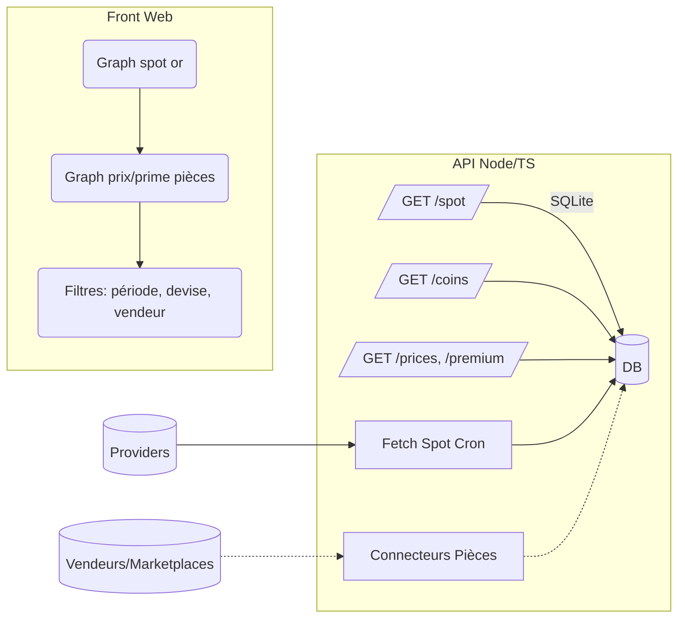

# Architecture (proposition)

- Front-end: React + TypeScript (Vite ou Next.js), ECharts pour graphes.
- API: Node.js + TypeScript (Express/Koa), tâches planifiées (node-cron) pour récupérer le spot.
- Stockage: SQLite (via Prisma), tables normalisées pour spot/coins/prices. CSV/JSON en v0.
- Connecteurs sources: adaptateurs par provider (spot, pièces) activables via config.

## Modèle de données (SQL)
- spot_prices(id, ts_utc, currency, price_per_oz, price_per_g)
- coins(id, name, country, fineness, weight_total_g, fine_weight_g, agw_oz, years, mint)
- coin_prices(id, coin_id, ts_utc, vendor, price, currency, src_url, condition)
- Vue: premiums(coin_id, ts_utc, premium_pct, melt_value, price)

## Calculs
- spot_par_g = price_per_oz / 31.1034768
- melt_value = spot_par_g * fine_weight_g
- premium_pct = price / melt_value - 1
